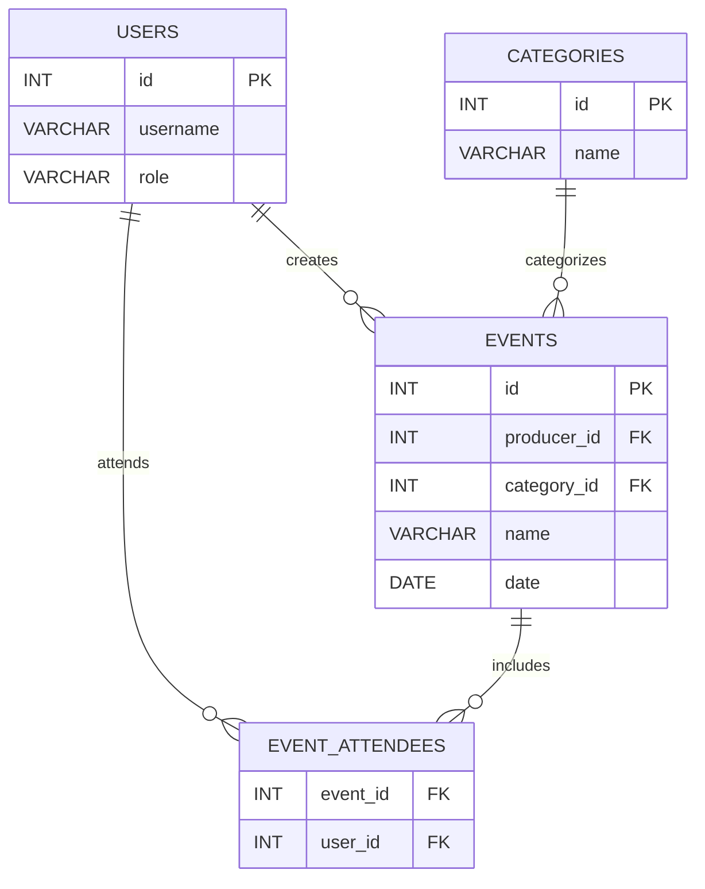

# Event Manager
This project is part of the course `Fundamentals of Concurrent, Parallel, and Distributed Computing` at `Cesar School`. It showcases the development of a `Flask` application in `Python` for an Event Manager that performs CRUD operations on a PostgreSQL database. The project uses `Docker` and `Docker Compose` to create isolated environments for the application and database, enabling connections between the containers, facilitating easy scaling, consistent setups, and streamlined management of dependencies.

## Instructions
### Clone the repository
```bash
git clone https://github.com/pedro-coelho-dr/event-manager.git
```
```bash
cd event-manager
```
### Running the application locally
- Create a virtual environment:   
  
Linux:
```bash
python3 -m venv venv
```
```bash
source venv/bin/activate
```
Windows:
```bash
python -m venv venv
```
```bash
.\venv\Scripts\activate
```
   - If ExecutionPolicy is restricted:
```bash
Set-ExecutionPolicy RemoteSigned -Scope CurrentUser
```

- Install dependecies:
```bash
pip install -r requirements.txt
```
- After [initializing the database](#database-initialization), run the application:
```bash
   flask run --debug
```

### Run the application with Docker 
   ```bash
   docker-compose up
   ```
   - [initialize the database](#database-initialization) and seed it

### Database initialization
- Migrate the database:
```bash
flask db init
```
```bash
flask db migrate -m "Initial migration"
```
```bash
flask db upgrade
```
- Seed the database:
```bash
python db/seed.py
```
- Clean the database:
```bash
python db/clean.py
```

### Open the application
- Flask application:
```bash
   localhost:5000
```
- Adminer
```bash
   localhost:8080
```

## Database Entities

### 1. Users

| Column     | Type             | Description                                                      |
|------------|------------------|------------------------------------------------------------------|
| id         | SERIAL PRIMARY KEY | Unique identifier                                |
| username   | VARCHAR(50) UNIQUE | login credential                 |
| role       | VARCHAR(10) CHECK (role IN ('User', 'Producer')) NOT NULL | 'User' or 'Producer' |

### 2. Categories

| Column     | Type               | Description                        |
|------------|--------------------|------------------------------------|
| id         | SERIAL PRIMARY KEY | Unique identifier |
| name       | VARCHAR(50) UNIQUE | Name of the category |

### 3. Events

| Column       | Type               | Description                                                          |
|--------------|--------------------|----------------------------------------------------------------------|
| id           | SERIAL PRIMARY KEY | Unique identifier                                     |
| producer_id  | INT REFERENCES users(id) | References the producer who created the event |
| category_id  | INT REFERENCES categories(id) | References the event’s category                                  |
| name         | VARCHAR(100)       | Name of the event.                                                   |
| date         | DATE               | Date the event                                        |

### 4. Event_Attendees

| Column     | Type               | SDescription                                                      |
|------------|--------------------|------------------------------------------------------------------|
| event_id   | INT REFERENCES events(id) ON DELETE CASCADE | References the event being attended                        |
| user_id    | INT REFERENCES users(id) ON DELETE CASCADE | References the user attending the event                  |
| PRIMARY KEY | (event_id, user_id) | Primary key|


## Database Schema



### Sample CRUD operations on the containerized database
```bash
docker exec -it postgres-event-manager psql -U admin -d event_manager_db
```
```sql
SELECT * FROM users;
SELECT * FROM categories;
SELECT * FROM events;
SELECT * FROM event_attendees;
```
```sql
INSERT INTO users (username, role) VALUES ('user3', 'user');
INSERT INTO users (username, role) VALUES ('producer3', 'producer');
INSERT INTO categories (name) VALUES ('category1');
INSERT INTO categories (name) VALUES ('category2');
INSERT INTO events (producer_id, category_id, name, date) VALUES (4, 4, 'event90', '2024-12-01');
INSERT INTO events (producer_id, category_id, name, date) VALUES (4, 5, 'event91', '2024-12-10');
```
```sql	
UPDATE users SET username = 'user4' WHERE username = 'user3';
UPDATE events SET date = '5555-12-05' WHERE name = 'event90';
```
```sql
DELETE FROM users WHERE username = 'user4';
DELETE FROM categories WHERE name = 'category1';
```

## Team
Gabriel Rossiter  
Matheus Gomes  
Pedro Coelho  